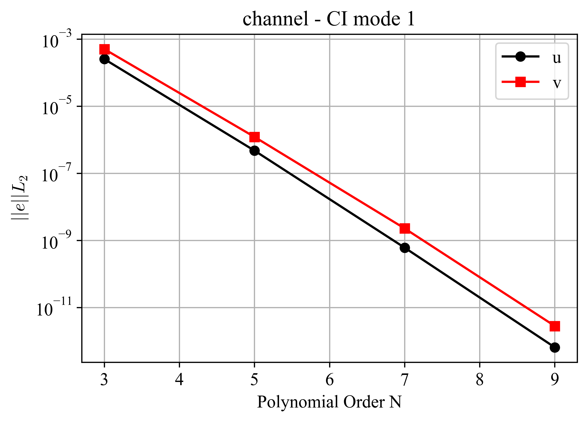
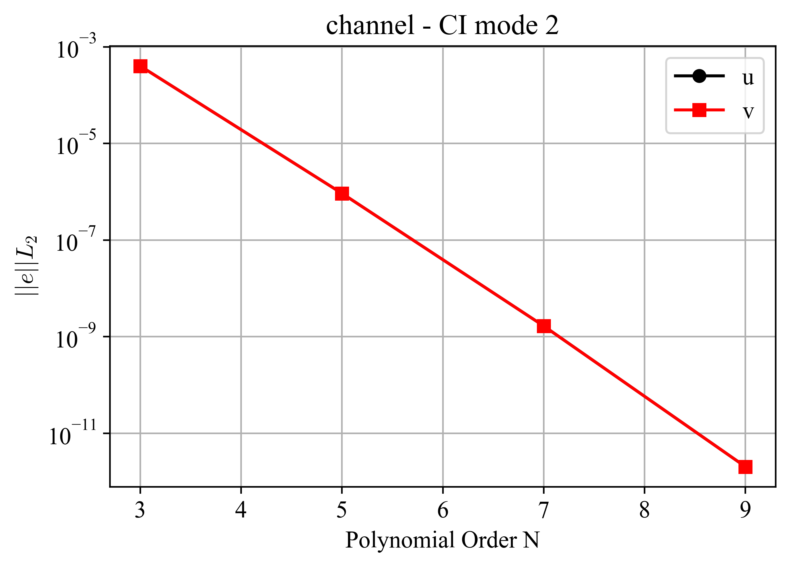

channel
=======

.. _channel:

NekRS offers the option to solve for unsteady Stokes flow with or without variable viscosity.
The *channel* test case exercises  the Stokes flow module in NekRS through the method of manufactured solution (MMS), solved in a quasi 2D square domain with edge length equal to 2 and an arbitrary, user-specified, orientation angle :math:`\alpha`.
The manufactured steady state solution is given as,

.. math::
  
  u' &= U_0 cos(\pi (x+0.5)) \, sin(\pi (2y + 0.5)) \\
  v' &= -\frac{U_0}{2} sin(\pi (x+0.5)) \, cos(\pi (2y + 0.5)) \\
  u(x,y) &= u' cos(\alpha) - v' sin(\alpha) \\
  v(x,y) &= u' sin(\alpha) + v' cos(\alpha) 

The manufactured variable viscosity :math:`\nu` is given as,

.. math::

  \nu (x,y) = \frac{1}{Re} (1 + ay)

where :math:`Re` is the Reynolds number, :math:`U_0` is a user-specified velocity scale, :math:`a` is a user-specified viscosity scale, and :math:`\{u,v\}` are the 2D velocity components in the :math:`x` and :math:`y` directions, respectively.
The forcing function :math:`\vec{f}` for testing the manufactured solution is, therefore, given as,

.. math::

  \vec{f} = - \nabla \nu \left(\nabla \vec{v} + \nabla \vec{v}^T \right)

In this case, the solution field is :math:`\phi=\{u,v\}`.
Tests are performed using a polynomial order of 7, while the reference error obtained in Sawtooth used a polynomial order of 5.
The CI mode 1 uses the original geometry, while the CI mode 2 rotates the geometry by :math:`45°`.
Errors were computed at :math:`t=0.1`.
Results for the error in the solution field using different polynomial orders are presented in :numref:`fig:channel1` and :numref:`fig:channel2` for each CI mode, respectively.
These figures illustrate the error decay trend for the velocity components, which exhibit spectral convergence.

.. _fig:channel1:

  :math:`L_2`-norm of errors for case channel CI mode 1.

.. _fig:channel2:

  :math:`L_2`-norm of errors for case channel CI mode 2.
