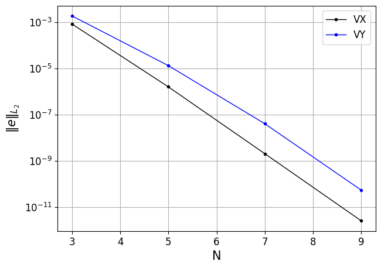
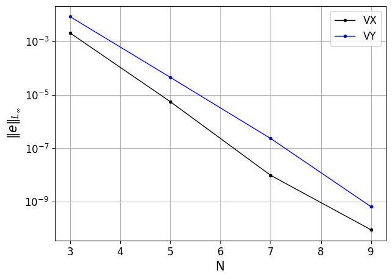

channel
=======

.. _channel:

NekRS offers the option to solver for unsteady Stokes flow with or without variable viscosity.
The *channel* test case excercises the Stokes flow module in NekRS through the method of manufactured solution (MMS), solved in a quasi 2D square domain with edge length equal to 2 and an arbitrary, user specified, orientation angle :math:`\alpha`.
The manufactured steady state solution is given as,

.. math::
  
  u' &= U_0 cos(\pi (x+0.5)) \, sin(\pi (2y + 0.5)) \\
  v' &= -\frac{U_0}{2} sin(\pi (x+0.5)) \, cos(\pi (2y + 0.5)) \\
  u(x,y) &= u' cos(\alpha) - v' sin(\alpha) \\
  v(x,y) &= u' sin(\alpha) + v' cos(\alpha) 

The manufactured variable viscosity is given as,

.. math::

  \nu (x,y) = \frac{1}{Re} (1 + ay)

where :math:`Re` is the Reynolds number, :math:`U_0` is a user specified velocity scale and :math:`a` is a user specified viscosity scale, while :math:`u,v` are the 2D velocity components.
The forcing function for testing the manufactured solution is, therefore, given as,

.. math::

  \vec{f} = - \nabla \nu \left(\nabla \vec{v} + \nabla \vec{v}^T \right)

:numref:`fig:channel1` and :numref:`fig:channel2` show the error decay trend for the velocity components exhibiting spectral convergence for both :math:`u` and :math:`v`.

.. _fig:channel1:

  :math:`L_2`-norm of errors

.. _fig:channel2:

  :math:`L_\infty`-norm of errors
