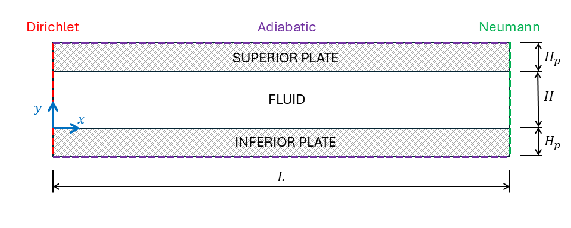

conj_ht
=======

.. _conj_ht:

NekRS capable of solving the Conjugated Heat Transfer (CHT) problem, i.e., solving the energy equation in the fluid and solid domains.
To demonstrate this capability, the *conj_ht* case is presented.
The domain consists of a 2-D channel of height :math:`H`, surrounded by two identical plates of height :math:`H_p` at the top and bottom of the channel, and with length :math:`L`. 
Uniform and constant heat is being generated in both plates.
Geometry is depicted in :numref:`fig:conj_ht_geometry`.

.. _fig:conj_ht_geometry:

  conj_ht geometry and boundary conditions.

Exact solutions for momentum and energy equations were obtained analytically, considering steady-state, thermally fully developed flow.
The boundary conditions considered are Dirichlet on the left side, Neumann on the right side, and adiabatic on the top and bottom surfaces.
The non-dimensional solution is the following,

.. math::

  U^*_x(y^*) = Re \frac{\partial p^*}{\partial x^*}y^*(1-y^*)

.. math::
  \begin{cases}
  T^*_S(x^*,y^*) = -\frac{\dot{q}^*Pe}{k^*_s} \left[ \frac{y^{*2}}{2} - y^*\left(1+\frac{H_p}{H}\right) + \left(\frac{1}{2}+\frac{H_p}{H}\right)\right] + \dot{q}^* \frac{H_p}{H} \left[2x^*+\frac{17}{70}Pe\right]

  T^*_I(x^*,y^*) = -\frac{\dot{q}^*Pe}{k^*_s} \left[ \frac{y^{*2}}{2} + y^*\frac{H_p}{H} \right] + \dot{q}^* \frac{H_p}{H} \left[2x^*+\frac{17}{70}Pe\right]

  T^*_F(x^*,y^*) = -\dot{q}^*Pe\frac{H_p}{H} \left[ y^{*4} - 2y^{*3} + y^* \right] + \dot{q}^* \frac{H_p}{H} \left[2x^*+\frac{17}{70}Pe\right]
  \end{cases}

In the first equation, :math:`U^*_x` is the fluid :math:`x^*`-velocity, :math:`Re` is the Reynolds number, :math:`p^*` is the pressure, and :math:`\{x^*,y^*\}` are the coordinate locations. 
For the temperature solutions,  :math:`T^*_S` is the temperature of the superior plate, :math:`T^*_I` is the temperature of the inferior plate, :math:`T^*_F` is the temperature of the fluid, 
:math:`\dot{q}^*` is the total heat source generated on each plate, and :math:`Pe` is the Peclet number.
Parameters with a * superscript are non-dimensional.
The parameter :math:`k^*_s` is calculated as

.. math::

  k^*_s = \frac{k_s}{k_f}

where :math:`k_s` is the thermal conductivity of both plates, and :math:`k_f` is the thermal conductivity of the fluid. 
Both Reynolds and Pecklet numbers are calculated considering fluid properties as

.. math::
  Re = \frac{\rho_f U_0 H}{\mu_f}

.. math::
  Pe = \frac{\rho_f U_0 H Cp_f}{k_f}

where :math:`\rho_f` is the fluid density, :math:`U_0` is the reference velocity, :math:`\mu_f` is the fluid dynamic viscosity, and :math:`Cp_f` is the fluid heat capacity.
Case parameters are provided in :numref:`tab:setup`. 
The fluid non-dimensional bulk temperature :math:`T^*_b` is described as

.. math::
  T^*_b(x^*) = 2 \dot{q}^* \frac{H_p}{H} x^*

.. _tab:setup:

.. csv-table:: Case properties and simulation parameters.
   :align: center
   :header: "Parameter name","Variable","Value"
   :widths: 15, 10, 5

   "Non-dimensional channel height",":math:`H^*=H/H`","1"
   "Non-dimensional channel length",":math:`L^*=L/H`","8"
   "Non-dimensional plates heigh",":math:`H^*_p=H_p/H`", "0.5"
   "Reynolds Number",":math:`Re`","1000"
   "Pecklet Number",":math:`Pe`","1000"
   "Heat source",":math:`\dot{q}^*`","1"
   "Fluid density",":math:`\rho^*_f`","1"
   "Fluid heat capacity",":math:`Cp^*_f`","1"
   "Non-dimensional solid thermal conductivity",":math:`k^*_s`","10"
   "Solid density * thermal conductivity",":math:`\rho^*_s Cp^*_s`","0.1"
   "Pressure gradient", ":math:`\frac{\partial p^*}{\partial x^*}`", "-0.012"

Two CI modes are tested, the first one without subcycling and the second with subcycling.
Both tests are performed with polynomial order 5.
NekRS solution is compared with the exact solution.
To pass the tests, x-velocity and temperature :math:`L_2`-norms must be lower than a reference tolerance.