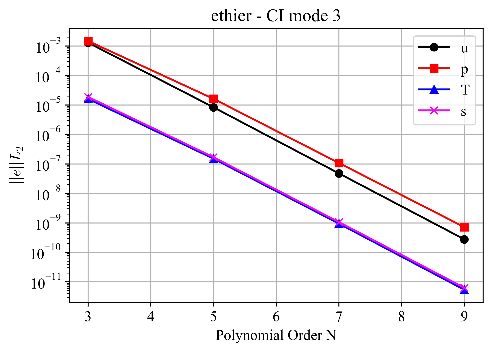
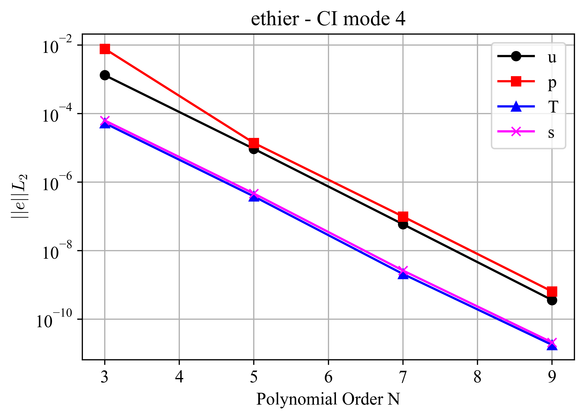
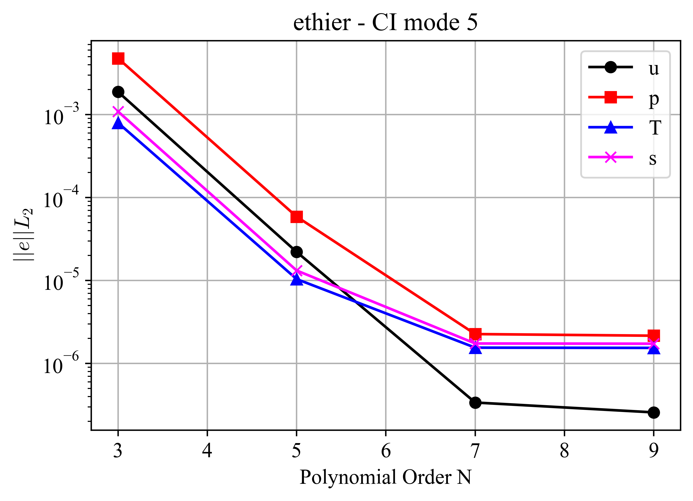
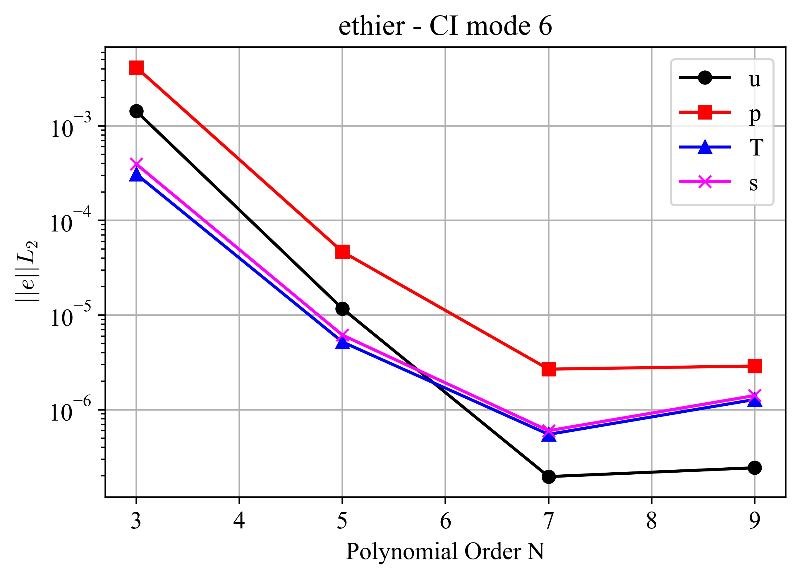
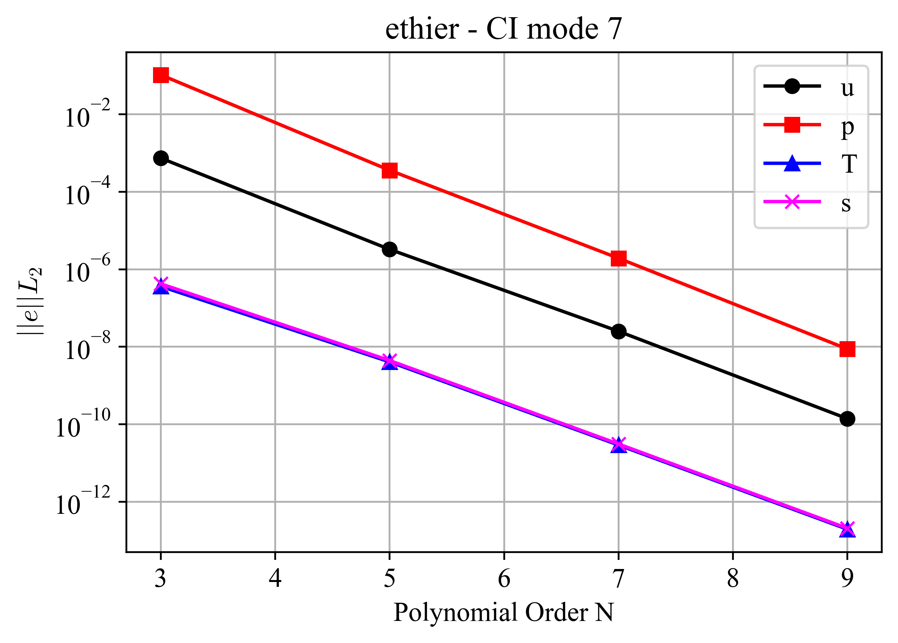
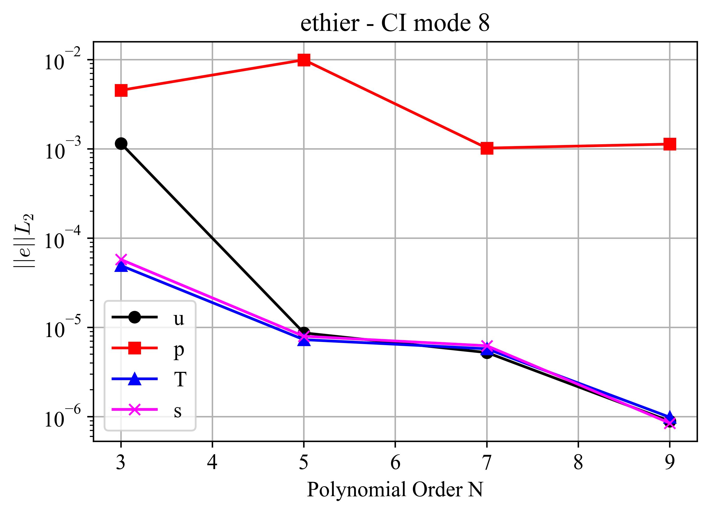
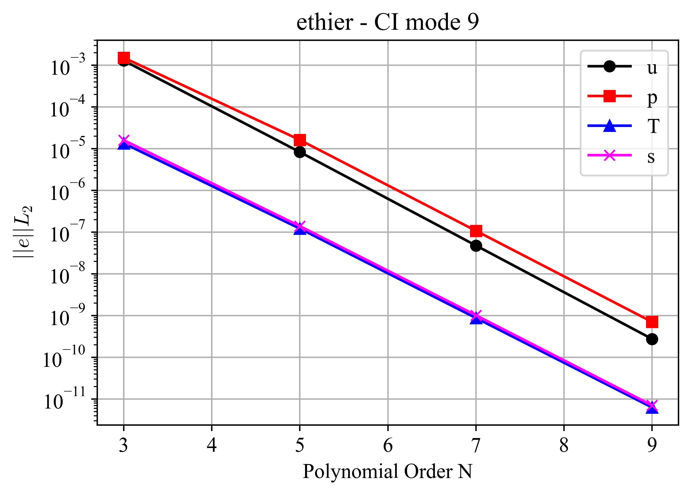
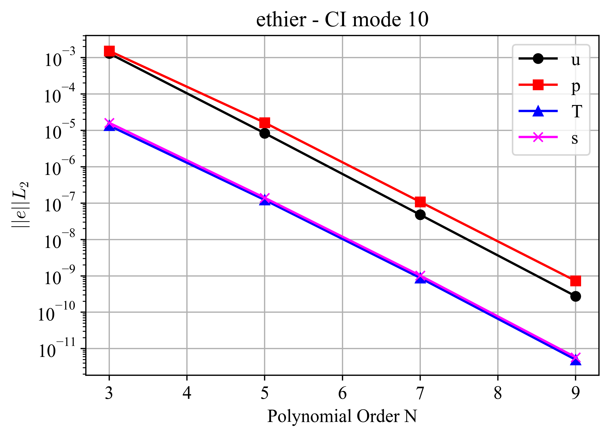
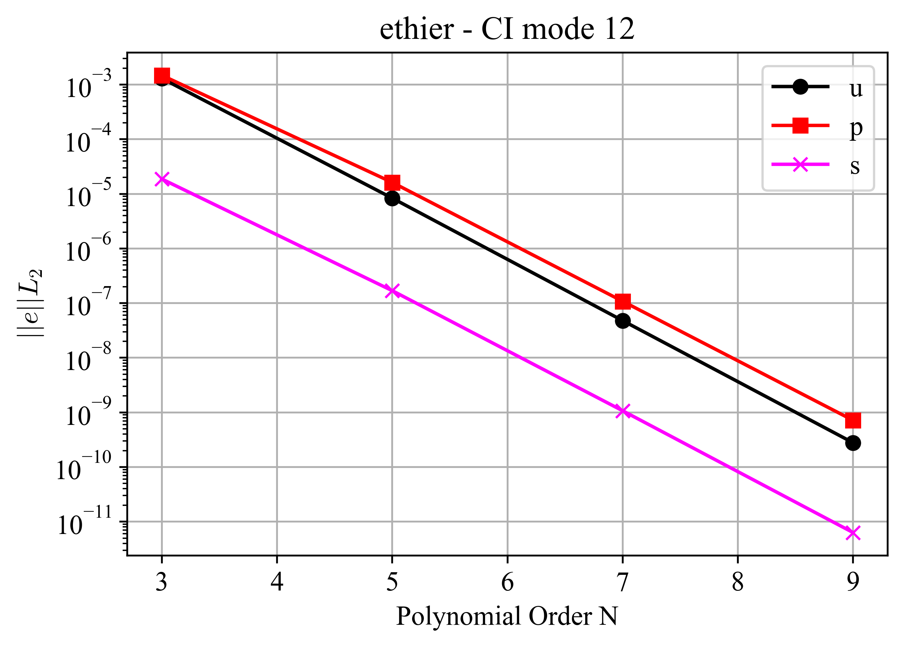
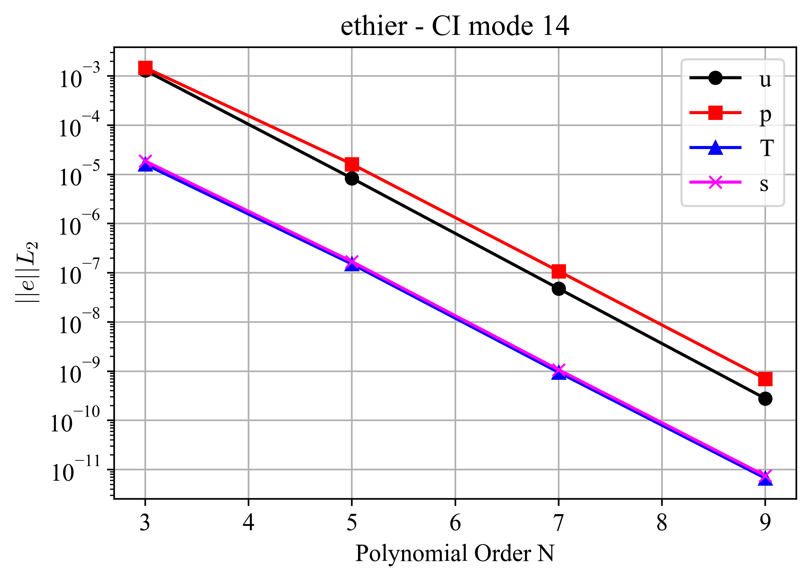

ethier
======

.. _ethier:

This case is adopted from the non-trivial, fictitious, exact solution for the 3D incompressible Navier-Stokes equation devised by Ethier et al. [Ethier1994]_ to benchmark incompressible CFD solvers.
Further, the solution from Ethier et al. is also adopted to test the passive scalar solvers in NekRS.
This can be done by considering the x-component of velocity as the transported passive scalar and the pressure term in the momentum equation as the source term, which makes the passive scalar equation identical to the x-momentum equation.
Since the exact solution is known in both time and space, the incompressible and/or passive scalar solvers can be run for only a few steps to evaluate solver accuracy, greatly minimizing the computational cost of each test.
Therefore, the *ethier* test case is used to evaluate several modules and components of the NekRS code, enumerated in Table 1.

The problem is set up in a :math:`[-1,1]` cube domain with Dirichlet boundary conditions assigned for the velocity solver and Dirichlet and Neumann boundary conditions assigned for the passive scalars :math:`s_1` and :math:`s_2`, respectively.
The boundary conditions are obtained from the exact solution from Ethier et al. [Ethier1994]_, given as,

.. math::

  u & =  -a \left[ e^{ax} sin(ay + dz) + e^{az} cos(ax + dy)\right] e^{-d^2 t} \\
  v & =  -a \left[ e^{ay} sin(az + dx) + e^{ax} cos(ay + dz)\right] e^{-d^2 t} \\
  w & =  -a \left[ e^{az} sin(ax + dy) + e^{ay} cos(az + dx)\right] e^{-d^2 t} \\
  p & =  -\frac{a^2}{t} \left[e^{2ax}+e^{2ay}+e^{2az} \right. \\
    & +         2 sin(ax+dy)cos(az+dx)e^{a(y+z)} \\
    & +         2 sin(ay+dz)cos(ax+dy)e^{a(z+x)} \\
    & +  \left. 2 sin(az+dx)cos(ay+dz)e^{a(x+y)} \right]e^{-2d^2t}

where :math:`a,d` are user-specified parameters, :math:`\{x,y,z\}` are the coordinate locations, :math:`\{u,v,w\}` are the velocity components, :math:`p` is the pressure, and :math:`t` is the time.
Note that, for the passive scalar solver tests, the transported variable is :math:`u`.

The solution fields are :math:`\phi=\{u,p,s_1,s_2\}` corresponding to the x-velocity, pressure, scalars 0 and 1, respectively.
The reference error used to evaluate the solver's performance was obtained in the HPC Sawtooth with a polynomial order of 7.
Tests are performed using a polynomial order of 9.

For all CI modes analyzed, the :math:`L_2`-norm was calculated for different polynomial orders :math:`N`, for the Navier-Stokes solver for the x-component of velocity, pressure, and from the passive scalar solver.
All figures presented below show the error decay trend.
These figures were obtained considering the CI modes reported in Table 1.
This trend confirms spectral decay of errors and demonstrates consistency and accuracy of both the flow and passive scalar solvers.
To evaluate the solver performance, the number of iterations required for the convergence of the x-velocity, pressure, and passive scalars is also included in the tests.

**CI Mode 2**

This CI mode verifies the correct functioning of the following capabilities of NekRS:

  * Incompressible Navier-Stokes and Passive Scalar solvers.
  * Subcycling.
  * Accelerated Conjugate Projection for the initial guess of the pressure.

Errors were computed at :math:`t=0.06` and are shown in :numref:`fig:ethier_2`.

.. _fig:ethier_2:

  :math:`L_2`-norm of errors for case ethier CI mode 2.

**CI Mode 3**

This CI mode verifies the correct functioning of:

  * Velocity and pressure projection.

Errors were computed at :math:`t=0.06` and are shown in :numref:`fig:ethier_3`.

.. _fig:ethier_3:

  :math:`L_2`-norm of errors for case ethier CI mode 3.

**CI Mode 4**

This CI mode tests that both features verified in CI modes 2 and 3 work together correctly. These are:

  * Incompressible Navier-Stokes and Passive Scalar solvers.
  * Subcycling.
  * Velocity and pressure projection.

Errors were computed at :math:`t=0.2` and are shown in :numref:`fig:ethier_4`.

.. _fig:ethier_4:

  :math:`L_2`-norm of errors for case ethier CI mode 4.

**CI Mode 5**

This CI mode tests:

  * Moving mesh.

Errors were computed at :math:`t=0.2` and are shown in :numref:`fig:ethier_5`.

.. _fig:ethier_5:

  :math:`L_2`-norm of errors for case ethier CI mode 5.

**CI Mode 6**

This CI mode tests:

  * Moving mesh.
  * Subcycling.

Errors were computed at :math:`t=0.2` and are shown in :numref:`fig:ethier_6`.

.. _fig:ethier_6:

  :math:`L_2`-norm of errors for case ethier CI mode 6.

**CI Mode 7**

This CI mode tests:

  * Velocity and pressure projection.
  * Jacobi preconditioner for the pressure solver.

Errors were computed at :math:`t=0.012` and are shown in :numref:`fig:ethier_7`.

.. _fig:ethier_7:

  :math:`L_2`-norm of errors for case ethier CI mode 7.

**CI Mode 8**

This CI mode tests:

  * Velocity and pressure projection.
  * Variable time-step.

This CI mode also tests that the final CFL number is below the target number, and the total number of time steps.
Errors were computed at :math:`t=0.2` and are shown in :numref:`fig:ethier_8`.
This is the only CI mode that does not show a spectral decay trend.

.. _fig:ethier_8:

  :math:`L_2`-norm of errors for case ethier CI mode 8.

**CI Mode 9**

This CI mode tests:
  
  * Subcycling.
  * No dealiasing.
  * Pressure projection.

Errors were computed at :math:`t=0.06` and are shown in :numref:`fig:ethier_9`.

.. _fig:ethier_9:

  :math:`L_2`-norm of errors for case ethier CI mode 9.

**CI Mode 10**

This CI mode tests:

  * No dealiasing.
  * Pressure projection.

Errors were computed at :math:`t=0.06` and are shown in :numref:`fig:ethier_10`.

.. _fig:ethier_10:

  :math:`L_2`-norm of errors for case ethier CI mode 10.

**CI Mode 11**

This CI mode tests:

  * Chebyshev and Jacobi pressure multigrid smoother.
  * Subcycling.
  * Pressure projection.

Errors were computed at :math:`t=0.06` and are shown in :numref:`fig:ethier_11`.

.. _fig:ethier_11:

  :math:`L_2`-norm of errors for case ethier CI mode 11.

**CI Mode 12**

This CI mode tests:

  * Passive scalar 0 turned off.

Errors were computed at :math:`t=0.06` and are shown in :numref:`fig:ethier_12`.
Additionally, the test verifies that the passive scalar 0 is deactivated.

.. _fig:ethier_12:

  :math:`L_2`-norm of errors for case ethier CI mode 12.

**CI Mode 14**

This CI mode tests:

  * Pressure multigrid smoother ASM with additive V-cycle.
  * Subcycling.
  * Pressure projection.

Errors were computed at :math:`t=0.06` and are shown in :numref:`fig:ethier_14`.

.. _fig:ethier_14:

  :math:`L_2`-norm of errors for case ethier CI mode 14.