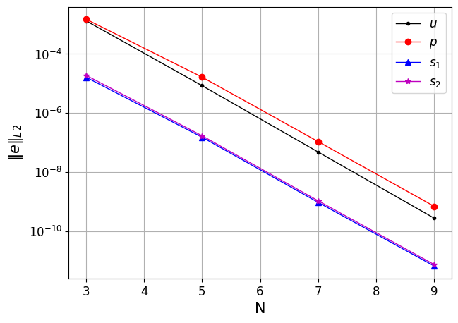

ethier
======

.. _ethier:

This case is adopted from the non-trivial, fictitious, exact solution for the 3D incompressible Navier-Stokes equation devised by Ethier et al [Ethier1994]_ for the purpose of benchmarking incompressible CFD solvers.
Further, the solution from Ethier et al is also adopted to test the passive scalar solvers in NekRS.
This can be simply done by considering the x-component of velocity as the transported passive scalar and the pressure term in the momentum equation as the source term, which makes the passive scalar equation identical to the x-momentum equation.
Since the exact solution is known in both time and space, the incompressible and/or passive scalar solvers can be run for only a few steps to evaluate solver accuracy, greatly minimizing the computational cost of each test.
Therefore, the *ethier* test case is used to evaluate several modules and components of the NekRS code, enumerated in Table 1.
The CI tests are evaluated by computing the $L2$-norm of the relative error in solution fields, :math:`\phi=\{u,v,w,p,s_1,s_2\}`,

.. math::

  \epsilon_\phi = \frac{\|\phi_{exact} - \phi\|_{L2}}{\|\phi_{exact}\|_{L2}}

The problem is setup in a :math:`[-1,1]` cube domain with Dirichlet boundary conditions assigned for the velocity solver and Dirichlet and Neumann boundary conditions assigned for the passive scalars :math:`s_1` and :math:`s_2`, respectively. 
The boundary conditions are obtained from the exact solution from Ethier et al [Ethier1994]_, given as,

.. math::

  u & =  -a \left[ e^{ax} sin(ay + dz) + e^{az} cos(ax + dy)\right] e^{-d^2 t} \\
  v & =  -a \left[ e^{ay} sin(az + dx) + e^{ax} cos(ay + dz)\right] e^{-d^2 t} \\
  w & =  -a \left[ e^{az} sin(ax + dy) + e^{ay} cos(az + dx)\right] e^{-d^2 t} \\
  p & =  -\frac{a^2}{t} \left[e^{2ax}+e^{2ay}+e^{2az} \right. \\
     & +   2 sin(ax+dy)cos(az+dx)e^{a(y+z)}  \\
     & +  2 sin(ay+dz)cos(ax+dy)e^{a(z+x)}  \\
    & +  \left. 2 sin(az+dx)cos(ay+dz)e^{a(x+y)} \right]e^{-2d^2t}

where :math:`a,d` are user specified parameters :math:`\{x,y,z\}` are the coordinate locations, :math:`\{u,v,w\}` are the velocity components and :math:`t` is the time.
Note that, as mentioned earlier, for the passive scalar solver tests, the transported variable is $u$ and the exact solution used for evaluating solver performance is also given by :numref:`fig:ethier`.
It shows the error decay trend obtained from the Navier-Stokes solver for the x-component of velocity and pressure and from the passive scalar solver.
The errors were computed at :math:`t=0.06` and the solver settings correspond to the CI mode index 2, as reported in Table 1.
The trend confirms spectral decay of errors and demonstrates consistency and accuracy of both the flow and passive scalar solvers.

.. _fig:ethier:

  :math:`L_2`-norm of errors
