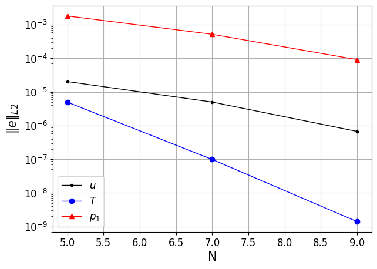
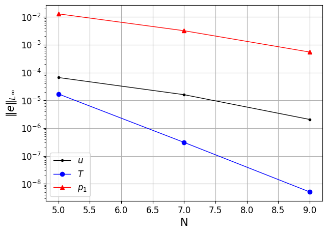

lowMach
=======

The low Mach compressible governing equations are obtained by filtering the acoustic waves from the fully compressible Navier-Stokes equations.
As a result, the pressure is split into spatially constant, leading order, thermodynamic component and hydrodynamic, first order, component which appears in the momentum equation [Tombo1997]_.
The lowMach equations can be used to describe phenomena in low speed reactive flows or natural convections simulations with high temperature differences where a description of thermal divergence is necessary to account for significant density changes in the fluid.

The *lowMach* case is adopted from Tomboulides et al [Tombo1998]_.
The problem is a non-trivial, contrived, quasi 2D, fixed boundary problem developed from the 1D system described as,

.. math::

  u \frac{\partial T}{\partial x} &= \frac{\alpha}{Re Pr} \frac{\partial^2 T}{\partial x^2} + \dot{q}_0 \\
  u \frac{\partial u}{\partial x} &= \frac{4\nu}{3 Re} \frac{\partial^2 u}{\partial x^2} - \frac{1}{\rho} \frac{\partial p_1}{\partial x} \\
  u \frac{\partial \rho}{\partial x} &= -\rho \frac{\partial u}{\partial x} \\
  \rho T &= 1

The problem is solved in a :math:`x=[-1,1]; y,z=[0,1]` domain with periodic boundary conditions specified along the :math:`y` and :math:`z` axis.
The heat source term in the energy equation constructed by Tomboulides et al [Tombo1998]_ is,

.. math::

  \dot{q}_0 = \frac{1}{\delta} sech^2 \left(\frac{x}{\delta}\right) \left( \frac{1}{2} + \frac{1}{\delta Re Pr} tanh \left(\frac{x}{\delta}\right) \right)

The exact solution for the above system is a smooth step profile, given by,

.. math::

  u(x) = T(x) = \frac{1}{2} \left(3 + tanh \left( \frac{x}{\delta} \right) \right)

where :math:`\delta` is a user specified parameter which controls the sharpness of the solution profile.
Dirichlet boundary conditions are specified at the x-extents of the domain, :math:`x=[-1,1]`, which correspond to the exact solution values from the above relation.
:numref:`fig:lowMach1` and :numref:`fig:lowMach2` show the decay trend of error norms for the *lowMach* case for the  x-component of velocity, hydrodynamic pressure and temperature fields.
All solution fields show spectrally vanishing errors, serving to validate the low Mach solver in NekRS.

.. _fig:lowMach1:

  :math:`L_2`-norm of errors

.. _fig:lowMach2:

  :math:`L_\infty`-norm of errors
