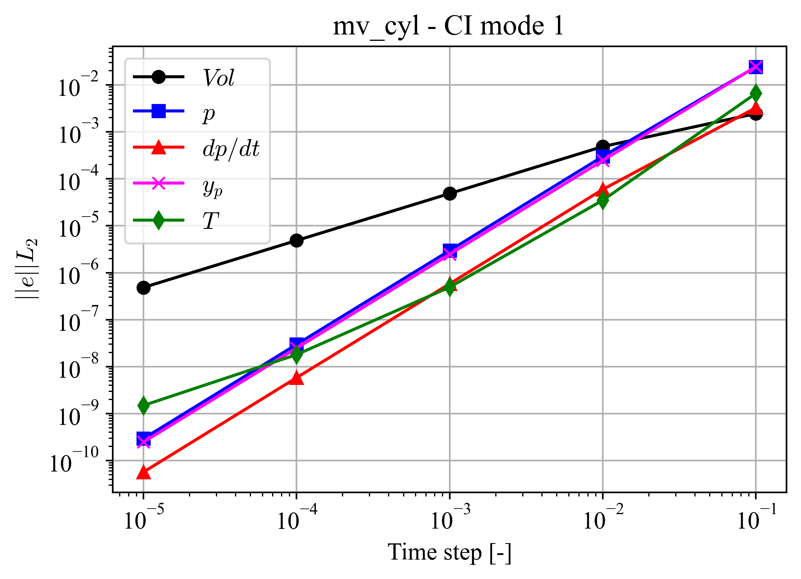
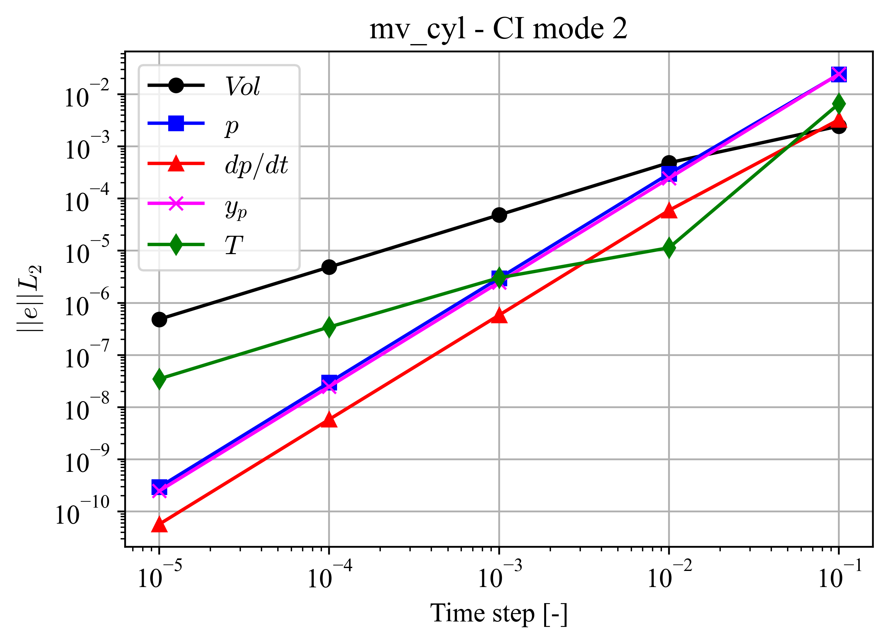
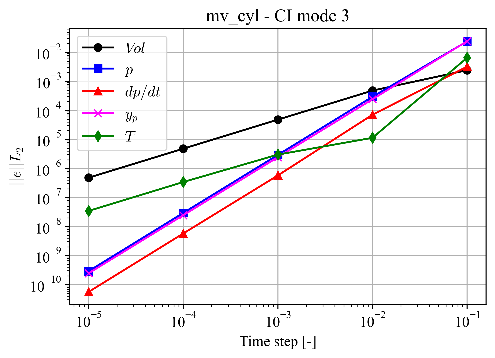
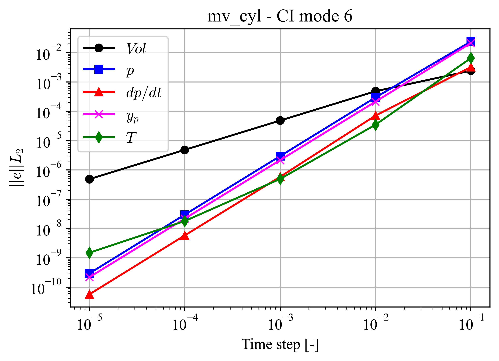

mv_cyl
======

.. mv_cyl:

NekRS can solve the system when the mesh is moving together with the low Mach formulation.
To verify this capability, the *mv_cyl* case is presented.
The geometry is a small 2D closed domain where the y-position of the inferior surface moves, resulting in an isentropic and adiabatic process.
The governing equations are

.. math::
  v_p(t) = A \ sin(\omega t)

.. math::

  Vol (t) = Vol_0 + A_p \ A \frac{(cos(\omega t) - 1)}{\omega}

.. math::

  p(t) = p_0 \left(\frac{Vol_0}{Vol(t)}\right)^\gamma

.. math::

  \frac{\partial p}{\partial t}(t) = \gamma \ p_0 \ A_p \ \frac{Vol_0^{\gamma}}{Vol(t)^{\gamma+1}} v_p(t)

.. math::

  y_p(t) = -\frac{1}{2} [1+cos(\omega t)]

.. math::

  T(t) = p(t)^{\left(\frac{\gamma-1}{\gamma}\right)}

.. math::
  
  \dot{V}_{term} (t) = v_p(t) A_p

where :math:`v_p` is the piston velocity, :math:`A` is the amplitud of the piston movement, :math:`\omega` is the fracuency of oscilation of the piston, :math:`t` is the time,
:math:`Vol` is the volume of the fluid inside the piston, :math:`Vol_0` is the initial volume of the gas, :math:`A_p` is the transversal area of the piston,
:math:`p` is the thermodynamic pressure, :math:`p_0` is the initial thermodynamic pressure, :math:`\gamma` is the heat capacity ratio, 
:math:`y_p` is the piston position, :math:`T` is the temperature of the fluid,
and :math:`\dot{V}_{term}` is the volumetric flux.

The solution fields are :math:`\phi=\{Vol,p,dp/dt,y_p,T,\dot{V}_{term}\}`.
Because of the nature of the problem, the :math:`L_2`-norm does not change with the polynomial order.
In this case, the time step :math:`dt` is the parameter that has the most significant influence on the convergence of the results.
Therefore, the convergence of the :math:`L_2`-norm is analyzed as a function of the time step.
Reference errors used to evaluate the solver performance were obtained in the HPC Sawtooth using a :math:`dt=1e-2`.
Tests are performed using a :math:`dt=1e-3`.
Additionally, the number of iterations for each solver is verified on each test.

As shown in the figures below, all parameters present a spectral convergence.
Results for :math:`\dot{V}_{term}` :math:`L_2`-norm are not included in the plots since errors were below system precision.

**CI Mode 1**

This CI mode verifies the correct functioning of the passive scalar solver NekRS with the moving mesh.
Errors were computed at :math:`t=0.1`, and are shown in :numref:`fig:mv_cyl_1`.

.. _fig:mv_cyl_1:

  :math:`L_2`-norm of errors for case mv_cyl CI mode 1.

**CI Mode 2**

This CI mode verifies the correct functioning of the following capabilities of NekRS:

  * All capabilities presented in the CI mode 1.
  * Sybcycling.

Errors were computed at :math:`t=0.1`, and are shown in :numref:`fig:mv_cyl_2`.

.. _fig:mv_cyl_2:

  :math:`L_2`-norm of errors for case mv_cyl CI mode 2.

**CI Mode 3**

This CI mode verifies the correct functioning of the following capabilities of NekRS:

  * All capabilities presented in the CI mode 2.
  * Elasticity solver.
  * Mesh projection.

Errors were computed at :math:`t=0.1`, and are shown in :numref:`fig:mv_cyl_3`.

.. _fig:mv_cyl_3:

  :math:`L_2`-norm of errors for case mv_cyl CI mode 3.

**CI Mode 5**

This CI mode verifies the capabilities presented in the CI mode 1 for an unaligned geometry.
Errors were computed at :math:`t=0.1`, and are shown in :numref:`fig:mv_cyl_5`.

.. _fig:mv_cyl_5:

  :math:`L_2`-norm of errors for case mv_cyl CI mode 5.

**CI Mode 6**

This CI mode verifies presented in the CI mode 3 for an unaligned geometry.
Errors were computed at :math:`t=0.1`, and are shown in :numref:`fig:mv_cyl_6`.

.. _fig:mv_cyl_6:

  :math:`L_2`-norm of errors for case mv_cyl CI mode 6.